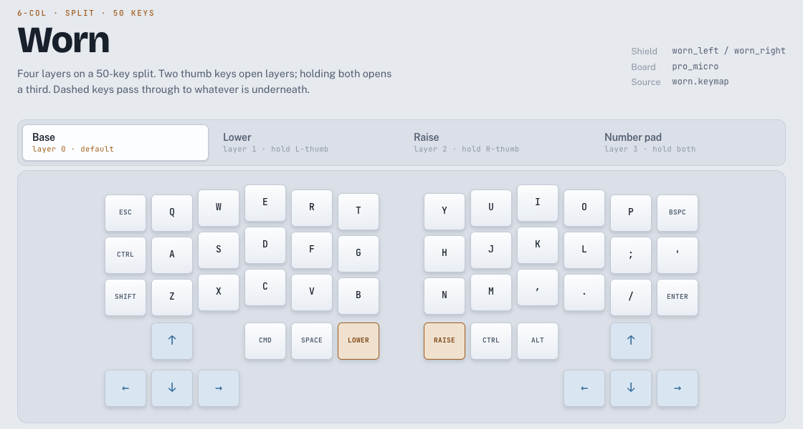

# Worn keymap

[](https://github.com/KWedey/worn-zmk/actions/workflows/build.yml)

Keymap for my Worn, a 50-key column-staggered split keyboard: four layers, a tri-layer number pad, and an inverted-T arrow cluster on each half.



**[Open the interactive keymap](https://kwedey.github.io/worn-zmk/keymap.html)** — browse every layer, swap keys, or turn on *Live test* and type to watch keys light up.

## How it fits together

| Piece | Role |
|---|---|
| [`boards/shields/worn/worn.keymap`](boards/shields/worn/worn.keymap) | The layout source of truth: every binding on every layer |
| [`keymap.html`](keymap.html) | Visual keymap, regenerated from the keymap by [`tools/sync-keymap-html.py`](tools/sync-keymap-html.py) |
| [`keyprobe.html`](keyprobe.html) | Three-press browser test that isolates which layer of the stack is swallowing a key combo |
| CI | Builds both halves with ZMK on every push, so a malformed keymap fails fast |
| worn-qmk (separate repo) | Converts this keymap to QMK and builds the firmware that is actually flashed |

The assembled board is an ATmega32U4 (AVR), which ZMK cannot target. [`HARDWARE.md`](HARDWARE.md) has the measurements behind that, and why the layout lives here anyway.

## Editing the layout

```bash
$EDITOR boards/shields/worn/worn.keymap
python3 tools/sync-keymap-html.py   # keep the visual keymap in step
git push                            # CI rebuilds both halves
```

Forked from [TrevorVonSeggern/worn-zmk](https://github.com/TrevorVonSeggern/worn-zmk).
